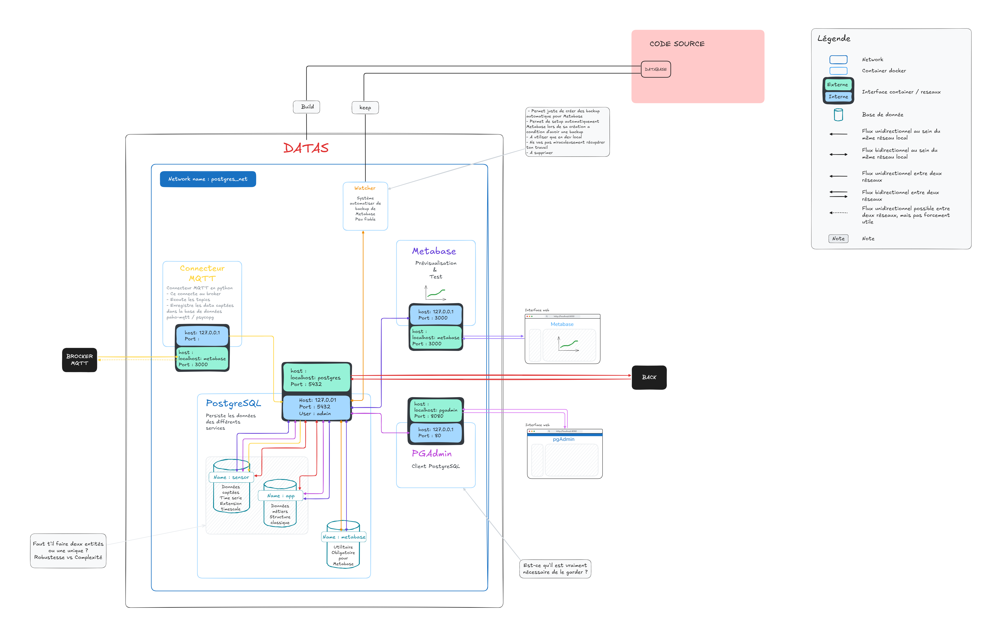

# H2Optimize - Database 

TODO 
- ameliorer le connecteur 
  - augmenter résilience
  - passer avec une extenesion pg 
  - node red
  
- argumentrer les choix technique 


[Escalidraw](https://excalidraw.com/?element=Ahl934wJmsXP_2y54ac9F#room=ff9fff0b0e37ded1e609,w3P887LL-U-rrDN3qX64AA)



## Instalation

Créer un fichier **/.env.local**
> Défaut le fichier vide (et c'est OK)

```bash
make startd
```

## Services 

### Persistance des données 

- Base postgres 
- Timescale

Basé sur l'image de timescale

Note : Pas d'optimisation, vérifier la version et les dépendance

---

### Client PostgreSQL 

Solution : *pgAmdin** 
Interface : [http://localhost:8080/](http://localhost:8080/)

Note :
- Configuration pour éviter les sécurité
- Pas configurer pour partir en prod
- Maintient optionel

#### Configuration 

En cas de changement des variable d'environnment modifier `/pgadmin/servers.json` et `/pgadmin/pgpass` pour garder la connexion automatique a la base de donnée

#### Redemarer

`docker compose --env-file $(ENV_FILE) --env-file $(ENV_LOCAL_FILE) up --build pgadmin`

---

### BI

- Metabase 

#### Taux d'humidité en temps réel par capteur

``` 
SELECT
  sensor_humidity.time AS time_bucket,
  sensor_humidity.humidity,
  CAST(sensor_humidity.source_address AS TEXT) AS source_address
FROM
  public.sensor_humidity
WHERE
  {{id_capteur}}
  [[ AND {{date}} ]]
GROUP BY
  time_bucket,
  sensor_humidity.humidity,
  source_address
ORDER BY
  time_bucket ASC;
```
id_capteur : filtre de champ lié à 'source_address'
date : filtre de champ lié à 'time'

### Watcher

**Optionnel**

- Permet juste de créer des backup automatique pour Metabase
- Permet de setup automatiquement Metabase lors de sa création a condition d'avoir une backup
- A utiliser que en dev local
- Ne vas pas miraculeusement récupérer ton travail
- A supprimer

Pour ne pas le lancer : 

Commenter le service dans docker-compose.yml

```
  watcher:
    build:
    ...
    restart: always
```

Lancer manuellement une backup :

`/entrypoint.sh manual-backup`

---

#### Température en temps réel par capteur

```
SELECT
  sensor_temperature.time AS time_bucket,
  sensor_temperature.temperature,
  CAST(sensor_temperature.source_address AS TEXT) AS source_address
FROM
  public.sensor_temperature
WHERE
  {{id_capteur}}
  [[ AND {{date}} ]]
GROUP BY
  time_bucket,
  sensor_temperature.temperature,
  source_address
ORDER BY
  time_bucket ASC;
```
id_capteur : filtre de champ lié à 'source_address'
date : filtre de champ lié à 'time'

---

### connecteur  mqtt python

---

## Aide 

### Comamande de base PostgreSQL 

```sql
-- Ce connecter a postgres
psql -U admin -d postgres

-- Voir les base de données
\l
```

#### Extraction des données des capteurs enregistrer dans app pour les mettres dans une nouvelle base de donnée, Recorded 

```sql
pg_dump -U admin -d app \
  --format=plain \
  --file=/backup/vergo_partial_backup.sql \
  --exclude-table=user \
  --exclude-table=building \
  --exclude-table=classroom \
  --exclude-table=promotion \
  --exclude-table=course \
  --exclude-table=sensor \
  --exclude-table=classroom_sensor \
  --exclude-table=user_promotion \
  --exclude-table=classroom_sensor_sensor \
  --exclude-table=classroom_sensor_classroom \
  --exclude-table=course_classroom
```

---


## Variable d'environnement

```

```


<!-- 
  # postgres:
  #   image: postgres:17.2-alpine3.21
  #   container_name: ${POSTGRES_CONTAINER_NAME}
  #   restart: always
  #   env_file:
  #     - .env
  #     - .env.local
  #   networks:
  #     - postgres_net
  #   ports:
  #     - "${POSTGRES_EXT_PORT}:5432"
  #   volumes:
  #     - ./:/docker-entrypoint-initdb.d
  #     - postgres_data:/var/lib/postgresql/data
  #     - ./backup:/backup
  #   healthcheck:
  #     test: ["CMD", "pg_isready", "-U", "${POSTGRES_USER}", "-d", "${POSTGRES_DB}"]
  #     interval: 5s
  #     retries: 5 -->
