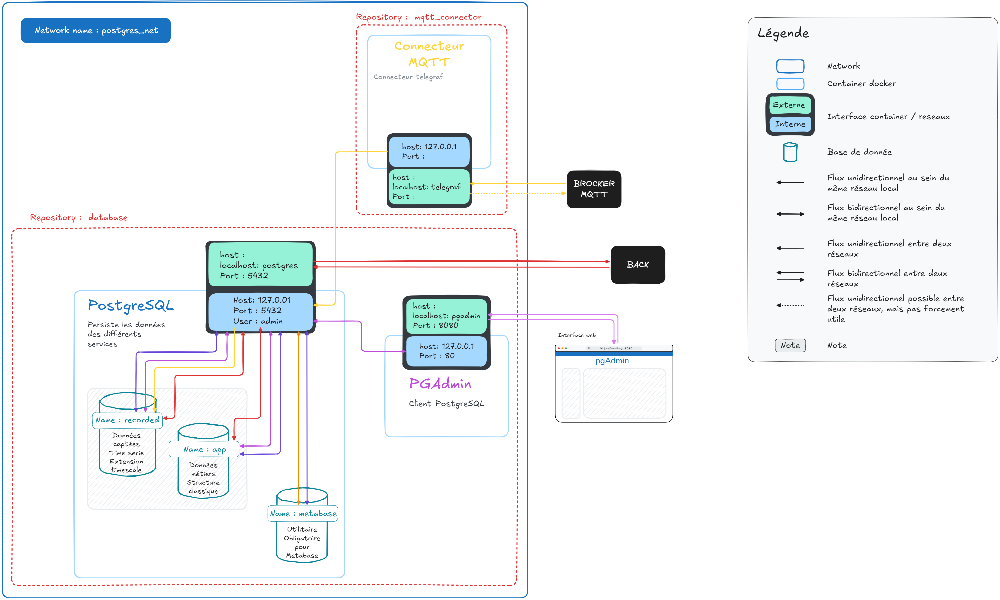
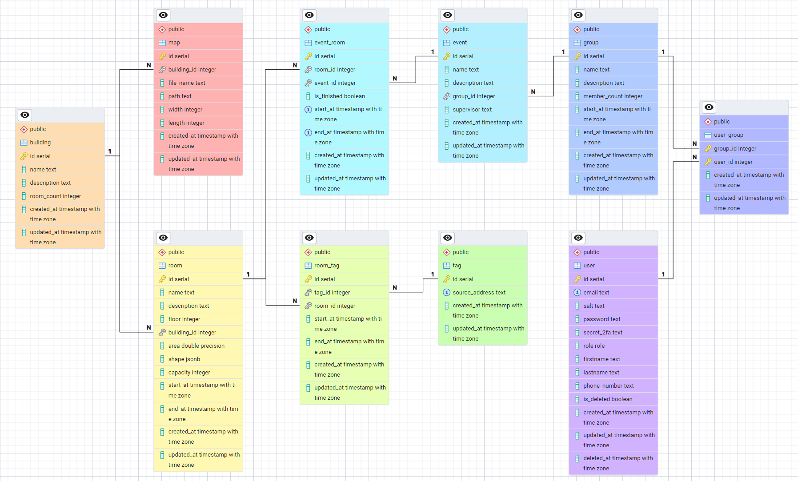
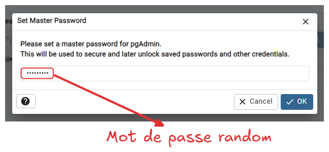

# H2Optimize - Database





## Installation

Créer un fichier **/.env.local**

> Par défaut, le fichier est vide (et c’est OK).

```bash
make startd
```

Si besoin de restaurer les données de la base, **ne pas lancer Telegraf simultanément** : attendre que la restauration soit **complète** avant de lancer Telegraf.

Restaurer les données de `recorded` :

* Lancer PostgreSQL.
* Supprimer les configurations d’initialisation de la base `recorded`.
* Lancer la restauration.

---


### Installation réussie lorsque :

1. Les conteneurs `postgres`, `metabase`, `watcher`, `pgadmin`, et `mqtt` tournent dans Docker.
2. Dans PostgreSQL :

```postgres
postgres=# \l
>> List of databases

   Name    | Owner | Encoding | Locale Provider |  Collate   |   Ctype    | Locale | ICU Rules | Access privileges 
-----------+-------+----------+-----------------+------------+------------+--------+-----------+--------------------
 app       | admin | UTF8     | libc            | en_US.utf8 | en_US.utf8 |        |           | 
 recorded  | admin | UTF8     | libc            | en_US.utf8 | en_US.utf8 |        |           |
```

```postgres
app=# \dt
                  List of relations
 Schema |            Name            | Type  | Owner 
--------+----------------------------+-------+-------
 public | building                   | table | admin
 public | classroom                  | table | admin
 public | classroom_sensor           | table | admin
 public | classroom_sensor_classroom | table | admin
 public | classroom_sensor_sensor    | table | admin
 public | course                     | table | admin
 public | course_classroom           | table | admin
 public | promotion                  | table | admin
 public | sensor                     | table | admin
 public | user                       | table | admin
 public | user_promotion             | table | admin
```

```postgres
recorded=# \dt
                List of relations
 Schema |          Name           | Type  | Owner 
--------+-------------------------+-------+-------
 public | sensor_humidity         | table | admin
 public | sensor_motion           | table | admin
 public | sensor_neighbors_count  | table | admin
 public | sensor_neighbors_detail | table | admin
 public | sensor_pressure         | table | admin
 public | sensor_temperature      | table | admin
 public | sensor_voltage          | table | admin
 public | sensor_button           | table | admin
```

3. pgAdmin est accessible et connecté aux bases de données.

---

## Services

### Persistance des données

* Base PostgreSQL
* TimescaleDB

Basé sur l’image Timescale.

**Note :**
Pas d’optimisation spécifique, vérifier la version et les dépendances.

---

### Client PostgreSQL

Solution : **pgAdmin**
Version : `dpage/pgadmin4`
Interface : [http://localhost:8080/](http://localhost:8080/)

**Remarques :**

* Configuration adaptée pour un environnement de développement (non sécurisée pour la production).
* Maintenance optionnelle.

#### Configuration

En cas de modification des variables d’environnement, mettre à jour les fichiers suivants pour maintenir la connexion automatique à la base de données :

* `/pgadmin/servers.json`
* `/pgadmin/pgpass`

#### Connexion



---

## Connecteur MQTT

Voir le service `mqtt_connector` (basé sur Telegraf).

---

## Commandes de base PostgreSQL

```sql
-- Se connecter à PostgreSQL
psql -U admin -d postgres

-- Voir les bases de données
\l

-- Backup de recorded 
pg_dump -U admin -d recorded --format=plain --file=/backup/recorded_backup_160720250900.sql


pg_dump: hint: You might not be able to restore the dump without using --disable-triggers or temporarily dropping the constraints.
```